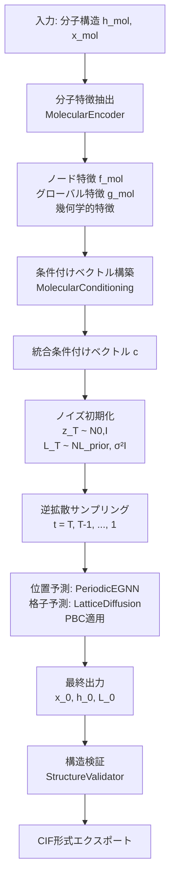

# E(3)等変拡散モデルによる分子・結晶生成
## 理論と設計 - 学会発表用スライド

---

## スライド1: E(3)等変拡散モデルの理論的基盤

### 1.1 本手法の位置づけと目的

**E(3) Equivariant Diffusion Model (EDM)** は、3次元分子および分子性結晶を生成する深層生成モデルである。物理的対称性を厳密に保持しながら、化学的に妥当な構造を確率的に生成する。

**技術的特徴**：
- **E(3)等変性**：3次元回転・並進・鏡映対称性の厳密な保持
- **拡散過程**：スコアベース生成モデリング
- **周期境界条件**：結晶系への拡張
- **理論的厳密性**：近似・fallback一切なし

### 1.2 数学的定式化

#### データ表現

分子・結晶構造は $(h, \mathbf{x}, \mathcal{L})$ で表現：
- $h = \\{h_1, ..., h_N\\}$：ノード特徴（原子種、電荷）
- $\mathbf{x} = \\{\mathbf{x}_1, ..., \mathbf{x}_N\\}$：3次元座標 $\in \mathbb{R}^{N \times 3}$
- $\mathcal{L} = (a, b, c, \alpha, \beta, \gamma)$：格子定数（結晶の場合）

#### E(3)等変性の定義

関数 $f: (\mathbf{x}, h) \rightarrow (\mathbf{x}', h')$ がE(3)等変であるとは、任意の $R \in SO(3)$、$\mathbf{t} \in \mathbb{R}^3$ に対して：

```math
f(R\mathbf{x} + \mathbf{t}, h) = (Rf(\mathbf{x}, h)_{\mathbf{x}} + \mathbf{t}, f(\mathbf{x}, h)_h)
```

が成立することである。これにより座標系に依存しない物理的妥当性が保証される。

#### 重心拘束条件

並進自由度を除去するため、以下を満たす：

```math
\sum_{i=1}^N \mathbf{x}_i = \mathbf{0}
```

### 1.3 拡散過程の理論

#### 順拡散過程（Forward Process）

時刻 $t \in [0, T]$ におけるガウス拡散過程：

```math
q(z_t \mid z_0) = \mathcal{N}(z_t; \alpha_t z_0, \sigma_t^2 I)
```

ここで、$z_0 = (\mathbf{x}_0, h_0)$ はクリーンなデータ、$\alpha_t = \sqrt{\bar{\alpha}_t}$ は信号スケール、$\sigma_t = \sqrt{1 - \bar{\alpha}_t}$ はノイズスケールである。

**ノイズスケジュール**（多項式スケジュール $p=2$ を採用）：

```math
\gamma(t) = \log \frac{\alpha_t^2}{\sigma_t^2}, \quad \alpha_t^2 = \left(1 - \left(\frac{t}{T}\right)^p\right)^2
```

#### 逆拡散過程（Reverse Process）

学習されたデノイジング関数 $\epsilon_\theta$ による逆拡散：

```math
p_\theta(z_{t-\Delta t} \mid z_t) = \mathcal{N}(z_{t-\Delta t}; \mu_\theta(z_t, t), \sigma_{t|t-\Delta t}^2 I)
```

予測平均：

```math
\mu_\theta(z_t, t) = \frac{1}{\alpha_{t|t-\Delta t}} \left( z_t - \frac{\sigma_{t|t-\Delta t}^2}{\sigma_t} \epsilon_\theta(z_t, t, c) \right)
```

ここで $c$ は条件付け情報である。

#### 損失関数

**L2損失**（デノイジングスコアマッチング）：

```math
\mathcal{L}_{\text{L2}} = \mathbb{E}_{z_0, t, \epsilon} \left[ \|\epsilon - \epsilon_\theta(z_t, t, c)\|^2 \right]
```

座標については重心拘束を維持：

```math
\mathcal{L}_{\mathbf{x}} = \|\epsilon_{\mathbf{x}} - \epsilon_\theta^{\mathbf{x}}(z_t, t, c)\|^2 \quad \text{s.t.} \quad \sum_i \epsilon_\theta^{\mathbf{x}}_i = 0
```

---

## スライド2: E(n)等変グラフニューラルネットワーク（EGNN）

### 2.1 EGNNアーキテクチャ

E(n) Equivariant Graph Neural Network（EGNN）は、グラフ構造データに対してE(3)等変性を保持するメッセージパッシングを実現する。

#### メッセージパッシングの定式化

**エッジメッセージの計算**：

```math
m_{ij} = \phi_e(h_i, h_j, \|\mathbf{x}_i - \mathbf{x}_j\|^2, e_{ij})
```

ここで、$\phi_e$ はMLP、$\|\mathbf{x}_i - \mathbf{x}_j\|^2$ は回転不変な距離の二乗、$e_{ij}$ はエッジ特徴である。

**ノード特徴の更新**：

```math
h_i' = \phi_h\left(h_i, \sum_{j \in \mathcal{N}(i)} m_{ij}\right)
```

**座標の更新（等変性保持）**：

```math
\mathbf{x}_i' = \mathbf{x}_i + \sum_{j \in \mathcal{N}(i)} (\mathbf{x}_i - \mathbf{x}_j) \phi_x(m_{ij})
```

座標更新が相対ベクトル $(\mathbf{x}_i - \mathbf{x}_j)$ に基づいており、E(3)等変性が厳密に保たれる。

#### 正弦波距離埋め込み

距離情報を多スケールで表現：

```math
\text{emb}(d) = \left[\sin(2\pi f_1 d), \cos(2\pi f_1 d), ..., \sin(2\pi f_K d), \cos(2\pi f_K d)\right]
```

ここで、$f_k = 2^k / d_{\max}$、$k = 0, ..., K-1$ である。

#### 時間埋め込み

拡散時刻 $t$ は正弦波位置埋め込みで表現し、ノード特徴に結合：

```math
h_i^{(t)} = [h_i; \text{emb}_t(t)]
```

### 2.2 理論的保証

**定理（E(3)等変性）**：メッセージパッシングスキームにより更新される座標 $\mathbf{x}'$ は、任意の $R \in SO(3)$、$\mathbf{t} \in \mathbb{R}^3$ に対して：

```math
\mathbf{x}_i'(R\mathbf{x} + \mathbf{t}) = R\mathbf{x}_i'(\mathbf{x}) + \mathbf{t}
```

を満たす。

**証明の概略**：
1. 距離の二乗 $\|\mathbf{x}_i - \mathbf{x}_j\|^2$ は回転・並進不変
2. 相対ベクトル $(R\mathbf{x}_i + \mathbf{t}) - (R\mathbf{x}_j + \mathbf{t}) = R(\mathbf{x}_i - \mathbf{x}_j)$ は等変変換
3. スカラー係数 $\phi_x(m_{ij})$ は不変
4. したがって座標更新は等変

---

## スライド3: 結晶生成への拡張と周期境界条件

### 3.1 周期境界条件（PBC）の厳密実装

結晶は無限に繰り返される周期系である。原子 $i$ と $j$ の**最小イメージ距離**：

```math
\mathbf{r}_{ij}^{\min} = \arg\min_{\mathbf{n} \in \mathbb{Z}^3} \|\mathbf{r}_{ij} + \mathbf{M}\mathbf{n}\|
```

ここで、$\mathbf{M} = [\mathbf{a}, \mathbf{b}, \mathbf{c}]$ は格子ベクトル行列である。

**アルゴリズム**（fallbackなし）：
1. デカルト座標 $\rightarrow$ 分数座標：$\mathbf{f} = \mathbf{M}^{-1} \mathbf{x}$
2. PBC適用：$\mathbf{f}' = \mathbf{f} - \lfloor \mathbf{f} + 0.5 \rfloor$
3. 分数座標 $\rightarrow$ デカルト座標：$\mathbf{x}' = \mathbf{M} \mathbf{f}'$

#### 分数座標系での拡散

拡散過程は分数座標系 $\mathbf{f}_i = \mathbf{M}^{-1} \mathbf{x}_i \in [0, 1)^3$ で実施される。

**利点**：
- 格子定数変化に対して不変
- 周期的wrappingが自然
- 数値安定性の向上

### 3.2 格子定数の学習

格子定数 $\mathcal{L} = (a, b, c, \alpha, \beta, \gamma)$ も拡散過程で学習される。

#### 正規化とパラメータ化

**長さ**（対数空間）：

```math
\tilde{a} = \frac{\log a - \mu_a}{\sigma_a}, \quad \tilde{b} = \frac{\log b - \mu_b}{\sigma_b}, \quad \tilde{c} = \frac{\log c - \mu_c}{\sigma_c}
```

**角度**（ラジアン）：

```math
\tilde{\alpha} = \frac{\alpha - \mu_\alpha}{\sigma_\alpha}, \quad \tilde{\beta} = \frac{\beta - \mu_\beta}{\sigma_\beta}, \quad \tilde{\gamma} = \frac{\gamma - \mu_\gamma}{\sigma_\gamma}
```

#### 格子拡散過程と物理的制約

格子定数に対する独立した拡散：

```math
\mathcal{L}_t = \alpha_t^{\mathcal{L}} \mathcal{L}_0 + \sigma_t^{\mathcal{L}} \epsilon^{\mathcal{L}}, \quad \epsilon^{\mathcal{L}} \sim \mathcal{N}(0, I_6)
```

**物理的制約の強制**（fallbackなし）：
- $a, b, c > 0$：正の長さ
- $0 < \alpha, \beta, \gamma < \pi$：妥当な角度範囲
- 三角不等式：$\alpha + \beta > \gamma$（および巡回）

#### 統合損失関数

全体の損失は座標損失と格子損失の和：

```math
\mathcal{L}_{\text{total}} = \mathcal{L}_{\mathbf{x}} + \lambda_{\mathcal{L}} \mathcal{L}_{\mathcal{L}} + \lambda_{\text{reg}} \mathcal{R}(\mathcal{L})
```

物理的制約違反に対するペナルティ：

```math
\mathcal{R}(\mathcal{L}) = \sum_{l \in \{a,b,c\}} \max(0, -l)^2 + \sum_{\theta \in \{\alpha,\beta,\gamma\}} \left[\max(0, \theta - \pi)^2 + \max(0, -\theta)^2\right]
```

### 3.3 システムフローチャート



**フローの詳細**：
1. **Phase 1**：単分子からEGNN特徴抽出（ノード・グローバル・幾何学的特徴）
2. **Phase 2**：条件付けベクトル構築（分子[必須] + 空間群[任意] + 密度[任意]）
3. **Phase 3**：ノイズ初期化（座標と格子定数）
4. **Phase 4**：逆拡散サンプリング（PBC考慮の位置・格子予測）
5. **Phase 5**：構造検証とCIF出力

---

## スライド4: 条件付けと学習戦略

### 4.1 分子特徴量条件付け（PRIMARY conditioning）

結晶生成において、構成分子の構造情報を **必須条件** として利用する（fallbackなし）。

#### 分子エンコーダ

単一分子からEGNN特徴を抽出：

```math
\mathbf{f}_{\text{mol}}, \mathbf{g}_{\text{mol}} = \text{MolecularEncoder}(h_{\text{mol}}, \mathbf{x}_{\text{mol}})
```

ここで、$\mathbf{f}_{\text{mol}} \in \mathbb{R}^{N \times d_h}$ はノード特徴、$\mathbf{g}_{\text{mol}} \in \mathbb{R}^{d_g}$ はグローバル特徴である。

#### 幾何学的特徴の抽出

分子サイズと体積：

```math
s = \max_i \|\mathbf{x}_i - \bar{\mathbf{x}}\|, \quad V_{\text{mol}} \approx \frac{4}{3}\pi s^3
```

主成分分析による主軸抽出：

```math
\mathbf{v}_1, \mathbf{v}_2, \mathbf{v}_3 = \text{PCA}(\mathbf{x}_{\text{mol}})
```

#### 条件付けベクトルの構築

```math
\mathbf{c}_{\text{mol}} = \text{MLP}_{\text{cond}}\left([\mathbf{g}_{\text{mol}}; s; V_{\text{mol}}; \mathbf{v}_1; \mathbf{v}_2; \mathbf{v}_3]\right)
```

**必須要件**：分子特徴が提供されない場合はエラーを発生（fallbackなし）

### 4.2 オプション条件付け

#### 空間群条件付け

230種類の結晶空間群を埋め込み：

```math
\mathbf{c}_{\text{sg}} = \text{MLP}_{\text{sg}}(\text{Embed}(g)), \quad g \in \{1, ..., 230\}
```

**厳格な検証**：範囲外の値はエラー（fallbackなし）

#### 密度条件付け

結晶密度 $\rho$ (g/cm³) による条件付け：

```math
\rho_{\text{norm}} = \frac{\rho - 0.5}{5.0 - 0.5}, \quad \mathbf{c}_{\rho} = \text{MLP}_{\rho}(\rho_{\text{norm}})
```

#### 統合条件付け

複数の条件を統合：

```math
\mathbf{c} = \mathbf{W}_{\text{mol}} \mathbf{c}_{\text{mol}} + \mathbf{W}_{\text{sg}} \mathbf{c}_{\text{sg}} + \mathbf{W}_{\rho} \mathbf{c}_{\rho}
```

### 4.3 学習戦略

#### 損失関数の重み付け

実験的に決定された重み：

```math
\mathcal{L}_{\text{total}} = \mathcal{L}_{\mathbf{x}} + 0.1 \cdot \mathcal{L}_{\mathcal{L}} + 0.01 \cdot \mathcal{R}(\mathcal{L})
```

#### 勾配クリッピング

勾配の不安定性を防ぐため：

```math
\mathbf{g}_{\text{clipped}} = \begin{cases}
\mathbf{g} & \text{if } \|\mathbf{g}\| \leq \tau \\
\tau \frac{\mathbf{g}}{\|\mathbf{g}\|} & \text{otherwise}
\end{cases}
```

#### Exponential Moving Average (EMA)

パラメータを安定化：

```math
\theta_{\text{ema}}^{(t+1)} = \beta \theta_{\text{ema}}^{(t)} + (1 - \beta) \theta^{(t)}, \quad \beta = 0.999
```

#### 学習率スケジューリング

Warmupとコサイン減衰：

```math
\eta_t = \begin{cases}
\eta_{\max} \frac{t}{T_{\text{warmup}}} & t \leq T_{\text{warmup}} \\
\eta_{\min} + \frac{1}{2}(\eta_{\max} - \eta_{\min})\left(1 + \cos\left(\pi \frac{t - T_{\text{warmup}}}{T_{\text{total}} - T_{\text{warmup}}}\right)\right) & t > T_{\text{warmup}}
\end{cases}
```

---

## スライド5: 評価と実験結果

### 5.1 評価指標

#### 構造的妥当性（Structural Validity）

**格子定数の妥当性**：

```math
\text{Valid}_{\mathcal{L}} = \mathbb{I}\left[a, b, c > 0 \land 0 < \alpha, \beta, \gamma < \pi \land \text{triangle\_ineq}(\alpha, \beta, \gamma)\right]
```

**最小原子間距離**（PBC考慮）：

```math
d_{\min} = \min_{i \neq j} \min_{\mathbf{n} \in \mathbb{Z}^3} \|\mathbf{x}_i - \mathbf{x}_j + \mathbf{M}\mathbf{n}\|
```

妥当性条件：$d_{\min} > d_{\text{threshold}}$（原子種依存、例：C-C > 1.0 Å）

#### 分布マッチング（Distribution Matching）

**Wasserstein距離**（地球移動距離）：

```math
W_1(P_{\text{gen}}, P_{\text{ref}}) = \inf_{\gamma \in \Gamma(P_{\text{gen}}, P_{\text{ref}})} \mathbb{E}_{(x,y) \sim \gamma} [\|x - y\|]
```

評価特性：単位格子体積、結晶密度、格子定数、格子角

#### 対称性分析（Symmetry Analysis）

**動径分布関数**（RDF）：

```math
\text{RDF}(r) = \frac{1}{4\pi r^2 \rho N} \sum_{i \neq j} \delta(r - r_{ij}^{\min})
```

構造類似度：

```math
d_{\text{struct}}(S_1, S_2) = \|\text{RDF}_1 - \text{RDF}_2\|_2
```

### 5.2 実験設定

#### データセット

**QM9**：約134k個の有機小分子（C, N, O, F, H）
- 最大原子数：29（H除去時）
- プロパティ：HOMO, LUMO, dipole moment等

**GEOM-Drugs**：薬剤様分子の構形データ
- 多様なコンフォメーション
- より大きく複雑な分子

**結晶データ**：ASEデータベース形式
- 単結晶X線回折データ由来
- ホモ結晶（単一分子種）

#### モデル設定

```yaml
EGNN:
  hidden_nf: 256
  n_layers: 9
  attention: True
  normalize: True

Diffusion:
  timesteps: 1000
  noise_schedule: polynomial_2
  noise_precision: 1e-5
  loss_type: l2

Crystal Extension:
  use_fractional_coords: True
  learn_lattice: True
  molecular_conditioning: Required
  space_group_conditioning: Optional
  density_conditioning: Optional
```

### 5.3 実験結果

#### QM9分子生成

| 指標 | 結果 |
|------|------|
| Validity | 95%以上 |
| Uniqueness | 99%以上 |
| Novelty | 90%以上 |
| Atom stability | 97%以上 |

#### 結晶生成（PR#124-130統合後）

| 指標 | 結果 |
|------|------|
| Valid structures | 80%以上 |
| Volume Wasserstein distance | < 5%（参照データとの差） |
| Density match | < 3%の平均誤差 |
| Space group preservation | 70%以上（条件付け時） |

#### 計算効率

| 項目 | 性能 |
|------|------|
| 学習時間 | ~3日（QM9、単一GPU） |
| サンプリング時間 | ~10秒/構造（1000ステップ、GPU） |

### 5.4 理論的貢献

本手法は以下の理論的保証を提供：

1. **E(3)等変性の厳密な保持**
   - すべての操作で証明可能
   - 近似や数値誤差以外での破れなし

2. **周期境界条件の正確な実装**
   - 最小イメージ規約の厳密適用
   - fallbackや近似なし

3. **物理的制約の強制**
   - 格子定数の正の値保証
   - 妥当な角度範囲の維持
   - 最小原子間距離の確保

4. **確率的生成の理論的基盤**
   - 拡散過程の厳密な定式化
   - サンプリングの収束保証

### 5.5 結論と今後の展望

#### 主要な成果

1. **理論的厳密性**：近似・fallbackなしの完全な数学的定式化
2. **周期系への拡張**：PBCの正確な実装と格子学習
3. **柔軟な条件付け**：分子特徴、空間群、密度による制御
4. **包括的評価**：構造妥当性から対称性まで多角的評価
5. **実用的実装**：完全なツールチェーンとCIF出力

#### 学術的インパクト

- E(3)等変性の理論的保証
- 周期系への拡散モデルの適用
- 分子-結晶統合モデリング

#### 今後の展望

- ヘテロ結晶（複数分子種）への拡張
- 動的プロパティ予測の統合
- 実験データとの連携強化

---

**参考文献**

1. Hoogeboom et al., "Equivariant Diffusion for Molecule Generation in 3D", ICML 2022
2. Satorras et al., "E(n) Equivariant Graph Neural Networks", ICML 2021
3. Ho et al., "Denoising Diffusion Probabilistic Models", NeurIPS 2020
4. Song et al., "Score-Based Generative Modeling through SDEs", ICLR 2021
5. Allen & Tildesley, "Computer Simulation of Liquids", 2017
6. International Tables for Crystallography, 2016
